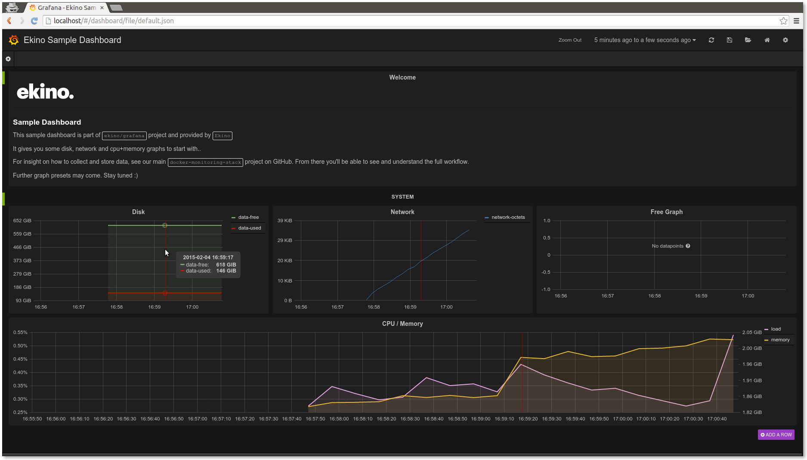

# Ekino Monitoring Stack

[](https://circleci.com/gh/ekino/docker-monitoring-stack)

## Description

This repo helps you create a 3 nodes pool of docker containers to easily
play with the monitoring stack
[`collectd`](https://collectd.org/) >
[`influxdb`](http://influxdb.com/) >
[`grafana`](http://grafana.org/)

It's also the official images sources for :
* [`ekino/influxdb`](https://registry.hub.docker.com/u/ekino/influxdb/)
* [`ekino/grafana`](https://registry.hub.docker.com/u/ekino/grafana/)
* [`ekino/collectd`](https://registry.hub.docker.com/u/ekino/collectd/)

*Note:*
The collectd image is here to have the full stack locally available.
IRL it may seems a bit meaningless because (you'll want to gather data at host
level, not container one) but it depends on the plugins you'll use (actionnable
plugin like `curl_json`, `tail_csv`, `ping`...)

*_ **This is a work in progress**. PR are welcomes folks :) _*

## TL;DR

Execute this command :

```bash
curl -sSL https://raw.githubusercontent.com/ekino/docker-monitoring-stack/master/helper.sh | bash -s run
```

And head to your new [local Grafana instance](http://localhost/) to get this result :



## Real-life usage

*TODO*


